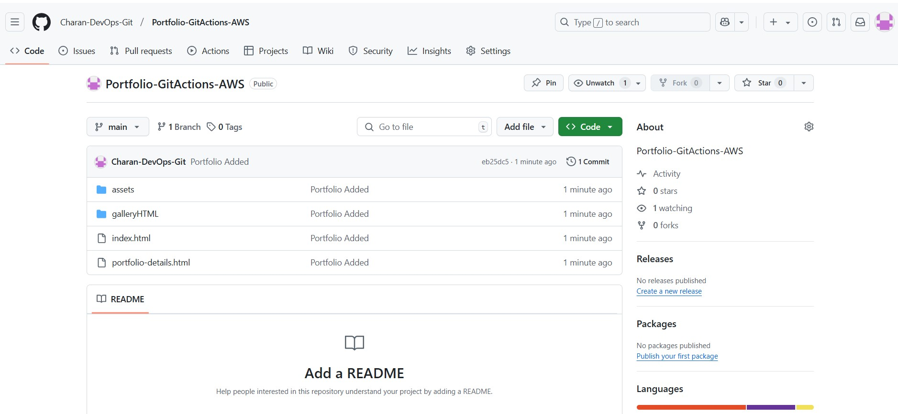
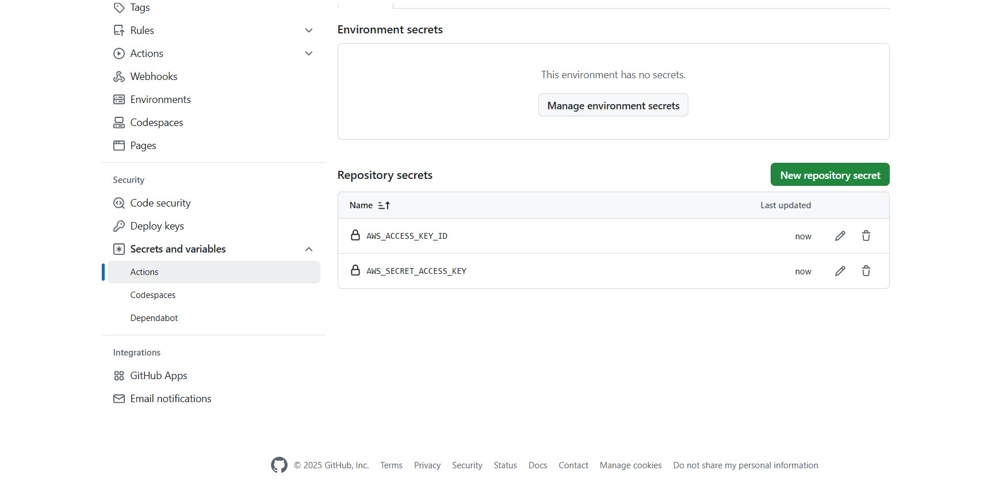
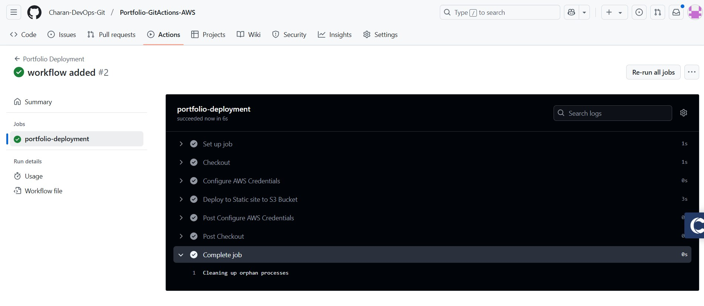
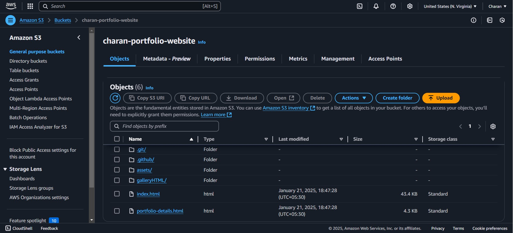

### **Project: Deploying a Portfolio Website with GitHub Actions and AWS**

#### **Tech Stack**
- Git
- GitHub Actions
- AWS S3

---

### **Steps to Deploy**
#### 1. **Develop & Host Website Code on GitHub**
- Create a repository for your portfolio website.
- Push the source code to GitHub.



#### 2. **AWS S3 Configuration**
- Go to the **AWS Management Console** and create a new **IAM User** with programmatic access for S3.
- Create an S3 bucket for hosting the portfolio.

#### 3. **Store AWS Credentials in GitHub Secrets**
- Navigate to `Settings` → `Secrets and variables` → `Actions` → `New Repository Secret`.
- Add secrets:
  - `AWS_ACCESS_KEY_ID`
  - `AWS_SECRET_ACCESS_KEY`



#### 4. **Create GitHub Actions Workflow**
- Open **GitHub Actions** → "Setup workflow yourself."
- Use the workflow below and commit changes:

```yaml
name: Portfolio Deployment

on:
    push:
        branches:
            - main

jobs:
    portfolio-deployment:
        runs-on: ubuntu-latest
        steps:
            - name: Checkout
              uses: actions/checkout@v3

            - name: Configure AWS Credentials
              uses: aws-actions/configure-aws-credentials@v3
              with:
                aws-access-key-id: ${{ secrets.AWS_ACCESS_KEY_ID }}
                aws-secret-access-key: ${{ secrets.AWS_SECRET_ACCESS_KEY }}
                aws-region: us-east-1

            - name: Deploy Static Site to S3 Bucket
              run: aws s3 sync . s3://charan-portfolio-website --delete
```

#### 5. **Run Workflow**
- On pushing code to the `main` branch, the GitHub Actions workflow runs automatically.
- After successful execution, files are uploaded to the S3 bucket.





#### 6. **Update S3 Bucket Policy**
- Add the following policy in the **Permissions** tab to allow public access:

```json
{
    "Version": "2012-10-17",
    "Statement": [
        {
            "Sid": "Statement1",
            "Effect": "Allow",
            "Principal": "*",
            "Action": "s3:GetObject",
            "Resource": "arn:aws:s3:::charan-portfolio-website/*"
        }
    ]
}
```

#### 7. **Enable Static Website Hosting**
- Navigate to **Properties** → Static Website Hosting → Enable hosting.
- Copy the **bucket website endpoint URL**.

#### 8. **Access Your Portfolio**
- Use the bucket endpoint to access your portfolio website.

---

### **Additional Suggestions**
1. **Enhance Security:**
   - Limit the bucket policy to only required actions (`s3:GetObject`) and specific IPs or services if possible.
   - Use environment-specific configurations (e.g., dev, prod buckets).

2. **Automate Bucket Policy Updates:**
   - Add AWS CLI commands to the workflow for automating bucket policy updates.

3. **Monitoring and Logging:**
   - Enable AWS S3 logging for detailed request analysis.

4. **Content Delivery Optimization:**
   - Use AWS CloudFront for caching and faster global delivery.